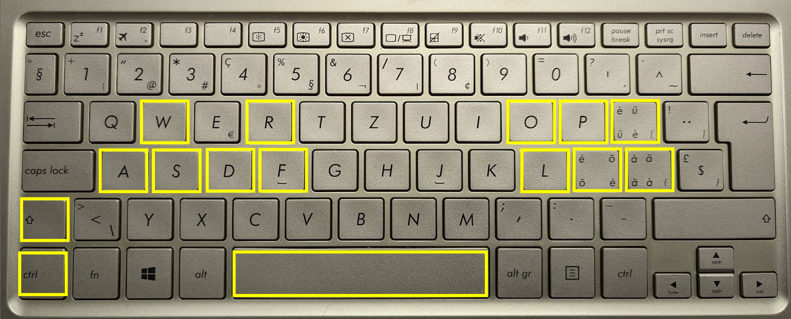

# 4d Visualizer

This repository contains software to visualize 3d intersections of 4d objects.
I wrote it as my high school diploma work.

It runs on Windows and Linux. It contains 3 binaries, representing successive
milestones of the project:

- `progs/3dcube`: A simple OpenGL display of a 3 dimensional cube. It has
  controls similar to computer games, to allow the user to explore the space.
- `progs/4dcube`: A canonical 4d cube (of which all vertices have either 1 or
   -1 coordinates) is intersected with a movable 3d hyperplane. We see the
   intersection using the same 3d exploration possibilities as before.
- `progs/multicube`: It can load a world definition from a yaml file. The
   world contains 4d cubes. Each cube is given as a rotated, then scaled,
   then translated version of the canonical cube.

# Compiling

- Ensure that you have a recent C++ compiler (tested only with C++20). For
  Windows, use "Build Tools for Visual Studio 2022". On Linux, I used a
  recent version of clang++.
- Install CMake (>3.24).
- Install Git, and clone the repository, or download the source from
  the Releases page on the right.
- Open a terminal from where you can use your compiler. On Windows, this
  specifically means starting "x64 Native Tools Command Prompt for VS 2022",
  and working from that window. On Linux, any terminal will do.
- Change to the source directory, and use CMake to build it.

```
mkdir build
cd build
cmake ..
cmake --build . --config Release
```

The binaries are produced in the `build/progs/<program name>` directory.
(On Windows, there's one extra directory level, named after the build
configuration, typically `Release` or `Debug`)

# Running the binaries

The first two (`3dcube` and `4dcube`) run without any arguments.

`multicube` needs a single argument, the file path to a world file.

There are example world files in `progs/multicube/worlds`, take a look
at them to see the syntax.

# Control

Use the following keys to control it:



If you have a different keyboard layout, still use the same physical
keys, the program uses scancode, and not the letter that is on the key.

The group on the right rotates the hyperplane. Each vertical pair rotates
the normal vector on a plane that it spans with one of the axes in the
3d hyperplane.

`R` and `F` translate the hyperplan along its normal vector.

The rest of the keys are standard camera movement keys, well known for
computer games.

Use the mouse to turn the camera. You need to have a coordinated movement
of the mouse and the keys on the left hand to go around an object.

