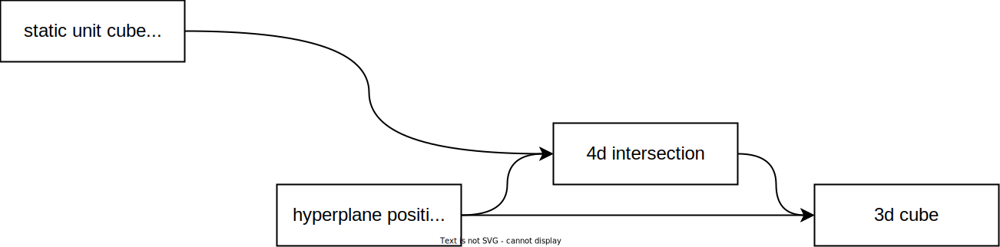
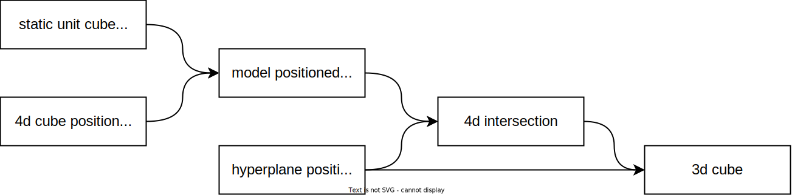

# Milestone 1: 3d cube presented with navigation [Done]

## Key results

- a 3d cube is rendered
- camera motion is controlled by the mouse, and the 4 standard movement keys

## Value

We bootstrapped the working environement and built an understanding of the core frameworks and libraries.

## Artifacts

- file: cube.cc
  - git repo: https://github.com/NandorKovacs/4dvisualizer
  - git commit: 985ab8f05dfe445aff72ad5c9819c02d87ca8a61

# Milestone 2: centered 4d unitcube with adjustable hyperplane position and camera [In-progress]

## Key results

A c++ program is delivered, which

- computes the intersection of a 4d unitcube with an arbitrary hyperplane
- renders this intersection as a three dimensional object
- can alter the parameters of the hyperplane interactively
- adjusts the rendered object in real time to the changes of the hyperplane
- can still navigate in the three dimensional world like in the previous milestone

## Value

The theory for the intersection is prooven to work. First impressions of the 4d cube can be aquired.

# Milestone 3: visibility effects

## Key Results

Object shading and lighting will be implemented.

## Value

The program allows us to experiment with parameters, form a visual idea 
about various projection shapes of the 4d cube and use it as an experiment and development platform 
for subsequent milestones.

With object shading and lighting the rendered picture will be more easily understood by the user. 

## Design

# Milestone 4: movable 4d cube

## Key results

A c++ program is delivered, in which 

- the user can adjust the rotation angle of the 4d cube via keys
- the user can move the projection plane via keys
- the user move the camera via keys
- values of the parameters are displayed as a hud
  - this is useful to allow storing of reproducible screenshots

## Value

We have a skeleton of the core of the code with end to end functionality.

## Design

# Milestone 5: World description

## Key results

- File format is defined to describe 4d objects
- parser is written 

## Value

We are ready to assemble the minimum project.

# Milestone 6: Full world rendering

## Key results

Program that can render a World described a config file, allows moving the projection plane as well as the camera in the 3d world.
Provides feedback of projection and camera position in a HUD.

## Value

This is a minimum viable solution of the original project description.